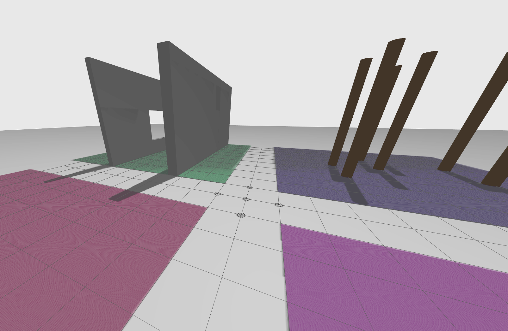
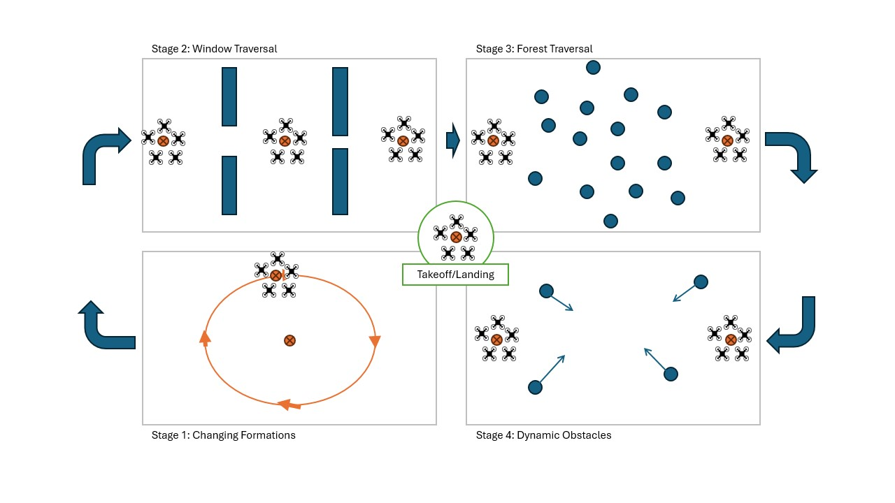

# COMP0240 Multi-Drone Challenge CW2

This repository contains the second coursework for the UCL Aerial Robotics Module COMP0240.



This challenge has been developed on top of the aerostack2 platform 

## Challenge

This challenge revolves around swarming of drones and formation flight. We are asking you to investigate the difference in performance and application of decentralised swarm based approaches versus centralised approaches to performing formation flight with a group of 5 drones (minimum 3 if experiencing technical issues) in 4 different scenario stages. 

### Swarming and Formation Flight

**Swarming** refers to the collective behaviour of multiple agents (drones) operating together using local rules without a centralised controller. These behaviours emerge from interactions between individual drones and their environment.

Swarm robotics takes inspiration from nature—such as birds, fish, and insects—to design scalable, flexible, and robust robotic systems. Swarm behaviours are often decentralised and self-organised, meaning that individual drones follow simple local rules that collectively result in a global pattern of behaviour.

Common decentralised swarm control strategies:

- Boids Model (Flocking Behaviour) – Uses three simple rules: separation, alignment, and cohesion.
- Potential Fields – Assigns virtual attractive/repulsive forces to goals and obstacles to guide movement.
- Optimisation-based Swarms – Optimisation approach focusing on local decision-making given a set of constraints.
- Bio-Inspired Methods – Use of indirect coordination through share environmental cues such as pheromone-based navigation or genetic algorithms.

**Formation flight** is a more structured approach to multi-agent coordination where drones maintain a specific geometric arrangement while moving. Unlike general swarming, formation flying often requires precise positioning and coordination.

Common formation flight strategies:

- Centralised Approaches
    - Leader-Follower – One drone acts as the leader dictating the trajectory while others maintain a relative position. This can be both centralised and de-centralised. For the latter, this introduces approaches where the swarm my automatically elect a new leader.
    - Multi-Agent Path Planning (MAPF) – Global centralised planning approach computed for the whole route and optimising e.g. for collision-free paths.
    - Virtual Structures – The entire formation is treated as a rigid body and controlled as one unit.
      
- Decentralised Approaches
    - Boids with Formation Constraints – Similar to flocking but with additional formation control.
    - Consensus-Based Control – Drones agree on formation changes based on local communication.
    - Distributed Potential Fields – Drones use attraction/repulsion forces while maintaining formation.

Swarming and formation flight have numerous real-world applications across various industries. 

- In aerial surveillance and search-and-rescue, swarming drones can quickly cover large areas, scan for missing persons, or assess disaster zones without relying on a single point of failure. 
- In logistics and delivery, drone swarms can efficiently transport packages in coordinated formations, optimizing airspace usage and reducing delivery times. 
- In environmental monitoring, swarms of drones can track wildlife migrations, detect deforestation, or monitor air and water quality over vast regions. 
- In entertainment and art, synchronized drone light shows use precise formation flight to create complex aerial displays, offering an innovative alternative to fireworks. 

These examples highlight the versatility of swarm robotics in enhancing efficiency, scalability, and adaptability in real-world operations.

### Your Challenge

We have created a competition style course with 4 different scenario stages to complete one after another. 

For each of these stages 1 to 4, you need to consider the coordination of 5 drones using either a centrialised and decentrialised method of your choosing. The aim is to route 5 drones through each scenario stage. If you have technical challenges, an acceptable minimum number of drones is 3.

In groups of 2, you will be investigating, developing and testing your algorithms in simulation.

1. **Stage 1: Changing Formations**: 
    - Implementing the formation flight algorithms which have the ability to changing the formation periodically whilst maintaining a circular trajectory. 
    - Compare different formation shapes (Line, V-shape, Diamond, Circular Orbit, Grid, Staggered)

2. **Stage 2: Window Traversal**: 
    - Using your formation flying methods attempt to maneouever your swarm of drones through two narrow windows slits. 
    - Consider how to split, rejoin, or compress the formation to pass through gaps.

3. **Stage 3: Forest Traversal**: 
    - Using your formation flying methods attempt to maneouever your swarm of drones through a forest of trees.
    - Your swarm should avoid collisions and maintain efficiency in movement.

4. **Stage 4: Dynamic Obstacles**: 
    - Using your formation flying methods attempt to maneouever your swarm of drones through a set of dynamically moving obstacles.  
    - You may need adaptive formation control to respond to changes in real time.



## Hardware Challenge Event at HereEast on 16th and 23rd March

In your groups, you will be given the opportunity to run a viable solution on real crazyflies.

I encourage as many groups as possible to join the event. We will be maintaining a leaderboard and points will be awarded based on success rate, reconfigurablity and time taken. A sign up sheet will be provided.

As an incentive to run your solution on hardware at UCL HereEast, groups have the chance to complete scenario stages 2 and or 3 depending on logistics and the number of crashes we have on the day. A small, low value prize will be provided to the winning solution. The event will be recorded. 

Regardless of whether you are competing or not, I encourage students to attend the sessions to support your fellow colleagues. 

## Installation

To install this project, create your ros workspace and clone the following into the source repo:

```bash
mkdir -p challenge_multi_drone_cw/src
cd challenge_multi_drone_cw/src
git clone https://github.com/UCL-MSC-RAI-COMP0240/aerostack2.git
git clone https://github.com/UCL-MSC-RAI-COMP0240/as2_platform_crazyflie.git # If intending to also fly on the crazyflie
```

> *Note*: Aerostack is our own branch as has addition for multi-drone stuff. This means you should build it from scratch using our repository to reduce potential issues. 

> *Note*: Crazyflie AS2 interface has been augmented with LED Control


Also then clone the repository into the **src** folder:

```bash
cd challenge_multi_drone_cw/src
git clone https://github.com/UCL-MSC-RAI-COMP0240/challenge_multi_drone.git
```

Please go to the root folder of the project and build it:

```bash
cd challenge_multi_drone_cw
colcon build
```

> **Note**: This repo contains a gazebo plugin to simulate the crazyflie LED deck. There have been some reports of issues with JSONCPP. If you get this issue, I have provided a modified `cmake` file to replace the existing one.
> 
> ```sudo cp challenge_multi_drone/config_sim/gazebo/plugins/led_ring_plugin/jsoncpp-namespaced-targets.cmake /usr/lib/x86_64-linux-gnu/cmake/jsoncpp/jsoncpp-namespaced-targets.cmake```
>
> Hopefully the `/usr/lib` directory is correct, if not then you will need to find the location of your jsoncpp library. 
>
> See [This Issue for more details](https://github.com/UCL-MSC-RAI-COMP0240/challenge_multi_drone/issues/1)


Once built, all of the following commads can be run from inside the root of this repository

```bash
cd challenge_multi_drone_cw/src/challenge_multi_drone
```

## Execution

### 1. Launch aerostack2 nodes for each drone
To launch aerostack2 nodes for each drone, execute once the following command:

```bash
./launch_as2.bash
```

The flags for the components launcher are:
- **-s**: scenario file to load from. Default is 'scenarios/scenario1.yaml'
- **-w**: world config file to use as base template. Default is 'config_sim/config/world.yaml'
- **-n**: select drones namespace to launch, values are comma separated. By default, it will get all drones from world description file
- **-c**: if set, the real crazyflie interface will be launched instead of the simulation. Defaults to false
- **-m**: if set, it will use the multicopter simulation platform instead of gazebo
- **-g**: launch using gnome-terminal instead of tmux. Default not set

> **NOTE:** You can also give or set the environment variable `CW2_SCENARIO_FILE` if you want to set the default to something different. You can either `export CW2_SCENARIO_FILE=scenarios/scenario.yaml` and/or put this line at the bottom of your `~/.bashrc` file and restart your terminal. 

### 2. Launch aerostack2 nodes for the ground station
To launch aerostack2 nodes for the ground station, execute once the following command:

```bash
./launch_ground_station.bash
```

The flags for the components launcher are:

- **-s**: scenario file to load from. Default is 'scenarios/scenario1.yaml'"
- **-c**: if set, the real crazyflie interface will be launched instead of the simulation. Defaults to false"
- **-t**: launch keyboard teleoperation. Default not launch
- **-v**: open rviz. Default not launch
- **-r**: record rosbag. Default not launch
- **-n**: drone namespaces, comma separated. Default get from world description config file
- **-g**: launch using gnome-terminal instead of tmux. Default not set

### 3. Launch a mission
There are several missions that can be executed:

- **AS2 Multi Drone**: 
  
  In terminal 1
  ```bash
  ./launch_as2.bash
  ```

  In a different terminal 2
  ```bash
  ./launch_ground_station.bash
  ```

  And then in one of your ground station terminals (or separately in a different terminal)
  ```bash
  python3 mission_swarm.py 
  ```

- **AS2 Multi Drone**: You can specify the specific scenario you wish to run
  ```bash
  ./launch_as2.bash -s scenarios/scenario1_stage1.yaml
  ```

  or 

  ```bash
  export CW2_SCENARIO_FILE=scenarios/scenario1_stage1.yaml
  ./launch_as2.bash
  ```

  or 
  
  ```bash
  echo "export CW2_SCENARIO_FILE=scenarios/scenario1_stage1.yaml" > ~/.bashrc
  source ~/.bashrc
  ./launch_as2.bash
  ```

  ```bash
  python3 mission_swarm.py 
  ```

- **AS2 Multi Drone**: You can specify the world file you wish to use as base to define the number of drones
  ```bash
  ./launch_as2.bash -w config_sim/config/world_swarm.yaml
  ```

  or 

  ```bash
  export CW2_WORLD_FILE=config_sim/config/world_swarm.yaml
  ./launch_as2.bash
  ```

  or 
  
  ```bash
  echo "export CW2_WORLD_FILE=config_sim/config/world_swarm.yaml" > ~/.bashrc
  source ~/.bashrc
  ./launch_as2.bash
  ```

  ```bash
  python3 mission_swarm.py 
  ```

- **AS2 Multi Drone NO GAZEBO** using multicopter simulation instead of gazebo: 
  
  In terminal 1 with the `-m` option
  ```bash
  ./launch_as2.bash -m
  ```

  In a different terminal 2, ensuring that your run rviz so you can see the obstacles
  ```bash
  ./launch_ground_station.bash -v
  ```
  
  Note that if you want to change world file, its a slightly different format so you will need to use the   templates available in `config_sim/config_multicopter`. e.g. `export CW2_WORLD_FILE=config_sim/config_multicopter/world_swarm.yaml`

  And then in one of your ground station terminals (or separately in a different terminal)
  ```bash
  python3 mission_swarm.py 
  ```


- **AS2 Multi Drone**: You can change the number of drones by providing a different world file (you could also modify the default `world.yaml` as well)

> **Note** for multicopter you will have to pass the relevant multicopter configuration instead e.g. `config_sim/config_multicopter/world_single.yaml`

  ```bash
  ./launch_as2.bash -w config_sim/config/world_single.yaml
  ```

  ```bash
  ./launch_as2.bash -w config_sim/config/world_swarm.yaml
  ```

- **AS2 Multi Drone**: You can explicitly specify the names of the drones to monitor
  ```bash
  ./launch_ground_station.bash -n drone0,drone1,drone2
  ```

  ```bash
  python3 mission_swarm.py -n drone0 drone1 drone2
  ```

- **AS2 Python API single drone mission**: You can execute a mission that used AS2 Python API, launching the mission with:
  ```bash
  python3 mission.py -n drone0
  ```

### 4. End the execution

If you are using tmux, you can end the execution with the following command:

```bash
./stop.bash
```

You can force the end of all tmux sessions with the command:
```bash
tmux kill-server
```

If you are using gnome-terminal, you can end the execution by closing the terminal.

> Note sometimes you may find gazebo stays running for some reason. It is recommended that you install hte `htop` utility. Running htop use F4 to search for gazebo. Select the running gazebo process and press F9. Then select `SIGKILL` and that will kill it. 

## Running Notes:

If you are running on ubuntu, depending on your system you may see a few different things going wrong:

1. Gazebo struggles to load up assets - this is likely either a ROS2 launch problem or a not enough CPU problem leading to race conditions. Launch with fewer drones. (Maybe even look into using the AS2 Multicopter rather than gazebo)
2. Aerostack2/ROS2 struggles with lots of drones - this is likely a not enough CPU problem


One thing that might help is forcing your terminal to use the NVIDIA GPU. It seems (depending on the laptop/desktop setup) that sometimes the terminal window will not run gazebo in gpu mode. To test this run this system, and in a separate terminal check `nvidia-smi`. If gazebo is using the GPU it will show there. If its not, you can force it to use the discrete GPU by adding the following lines to your `~/.bashrc` and restart your terminal, it should enable the GPU:

```
export __NV_PRIME_RENDER_OFFLOAD=1
export __GLX_VENDOR_LIBRARY_NAME=nvidia
```

## Developers guide

**Slightly out of date**

All projects in aerostack2 are structured in the same way. The project is divided into the following directories:

- **tmuxinator**: Contains the tmuxinator launch file, which is used to launch all aerostack2 nodes.
  - **aerostack2.yaml**: Tmuxinator launch file for each drone. The list of nodes to be launched is defined here.
  - **ground_station.yaml**: Tmuxinator launch file for the ground station. The list of nodes to be launched is defined here.
- **config**: Contains the configuration files for the launchers of the nodes in the drones.
- **config_ground_station**: Contains the configuration files for the launchers of the nodes in the ground station.
- **launch_as2.bash**: Script to launch nodes defined in *tmuxinator/aerostack2.yaml*.
- **launch_ground_station.bash**: Script to launch nodes defined in *tmuxinator/ground_station.yaml*.
- **mission_\*.py**: Differents python mission files that can be executed.
- **stop_tmuxinator_as2.bash**: Script to stop all nodes launched by *launch_as2.bash*.
- **stop_tmuxinator_ground_station.bash**: Script to stop all nodes launched by *launch_ground_station.bash*.
- **stop_tmuxinator.bash**: Script to stop all nodes launched by *launch_as2.bash* and *launch_ground_station.bash*.
- **rosbag/record_rosbag.bash**: Script to record a rosbag. Can be modified to record only the topics that are needed.
- **trees\***: Contains the behavior trees that can be executed. They can be selected in the *aerostack2.yaml* file.
- **utils**: Contains utils scripts for launchers.

Both python and bash scripts have a help message that can be displayed by running the script with the `-h` option. For example, `./launch_as2.bash -h` will display the help message for the `launch_as2.bash` script.

**Note**: For knowing all parameters for each launch, you can execute the following command:

```bash
ros2 launch my_package my_launch.py -s
```

Also, you can see them in the default config file of the package, in the *config* folder. If you want to modify the default parameters, you can add the parameter to the config file.
